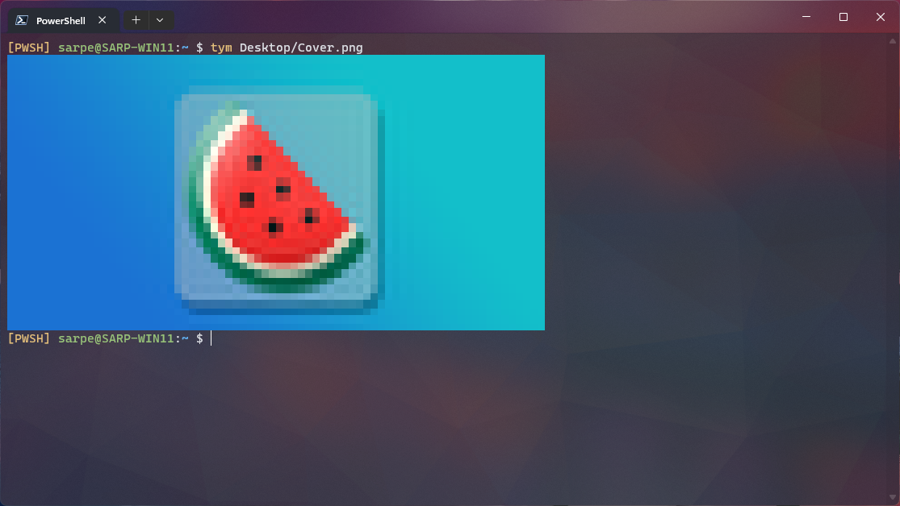

# 🍉 TYM

TYM is a cross-platform tool that renders image files in your terminal. It uses VT100 escape codes to display 24-bit true color images.

## Requirements
- Unicode supported monospace font
- VT100 compatible terminal emulator with true color support

## Download
Get the lastest version from [Releases](https://github.com/Segilmez06/tym/releases) page. You can also get a debug build from [Actions](https://github.com/Segilmez06/tym/actions/workflows/debug.yml) tab.

## Installation
Extract the zip file to a folder. Then add folder to your `PATH` variable.

## Usage
To be updated after a stable release, use `tym --help` instead.

## Screenshots

## Building
This tool is built on .Net 7 so it requires .Net SDK version >= 7 while building. 

### Optional
For AOT binary compilation, check [official documentation](https://learn.microsoft.com/en-us/dotnet/core/deploying/native-aot#prerequisites) for dependencies. This packages are only required while publishing. Skip this step if you're going to use JIT compiled binary.

## Contributing
You can create pull requests and issues to help development. Also starring the repo will give me motivation.
